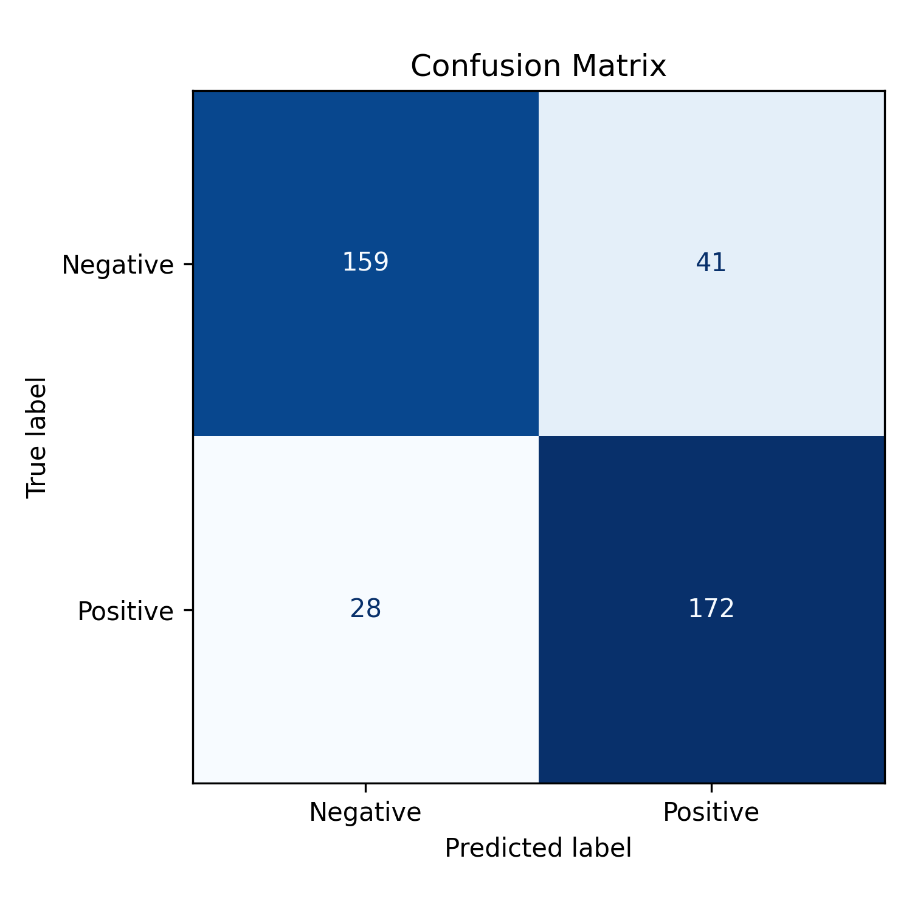

# sentiment-analysis-nlp
“Sentiment analysis on movie reviews using Logistic Regression and TF-IDF features.”
# Sentiment Analysis on Movie Reviews – Logistic Regression (NLP)

## 📌 Overview
This project performs **sentiment analysis** on the NLTK movie reviews dataset.  
Using **TF-IDF** features and **Logistic Regression**, the model predicts whether a review is **Positive** or **Negative**.

---

## 🛠 Tools & Libraries
| Purpose           | Library          |
|-------------------|-----------------|
| Dataset           | NLTK movie_reviews |
| Data handling     | pandas, numpy    |
| Vectorization     | scikit-learn (TfidfVectorizer) |
| Modeling          | scikit-learn (LogisticRegression) |
| Visualization     | seaborn, matplotlib |

---

## 📊 Results
- **Accuracy:** 0.83  
- **Classification report** shows balanced performance across classes.  

### Sample Outputs
  


---

## ▶ Usage
1. Clone the repository:  
   ```bash
   git clone https://github.com/<your-username>/sentiment-analysis-nlp.git

